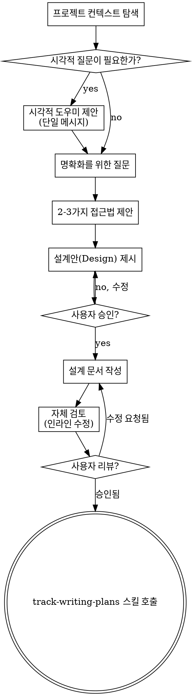

# 아이디어를 설계로 구체화하기 (Track-Brainstorming)

단순한 아이디어를 구체적인 설계와 스펙(Spec)으로 변환하기 위해 사용자와 자연스럽게 협업하며 대화합니다.

먼저 현재 프로젝트의 컨텍스트를 파악하고, 한 번에 하나씩 질문을 던져 아이디어를 다듬습니다. 무엇을 만들지 이해했다면 설계안을 제시하고 사용자의 승인을 받습니다.

<HARD-GATE>
설계안을 제시하고 사용자가 이를 승인하기 전까지는 **절대** 구현 스킬을 호출하거나, 코드를 작성하거나, 프로젝트 스캐폴딩을 하거나 구현 관련 어떠한 행동도 취하지 마십시오. 이는 프로젝트가 아무리 간단해 보이더라도 모든 경우에 예외 없이 적용됩니다.
</HARD-GATE>

## 안티 패턴: "이건 너무 간단해서 설계가 필요 없어"

모든 프로젝트는 이 과정을 거쳐야 합니다. 할 일 목록, 단일 함수 유틸리티, 설정 변경 등 모두 마찬가지입니다. "간단한" 프로젝트일수록 검증되지 않은 가정 때문에 헛수고를 할 확률이 높습니다. 설계안은 단 몇 문장으로 끝날 수도 있지만, 반드시 제시하고 승인을 받아야 합니다.

## 체크리스트 (Checklist)

반드시 아래 항목들에 대해 Task를 생성하고 순서대로 완료해야 합니다:

1. **프로젝트 컨텍스트 탐색** — 파일, 문서, 최근 커밋 내역 확인
2. **시각적 도우미 제안** (주제에 시각적 질문이 포함된 경우) — 명확히 분리된 단일 메시지로 제안 (하단 Visual Companion 섹션 참고)
3. **명확화를 위한 질문** — 한 번에 하나씩, 목적/제약조건/성공 기준 파악
4. **2~3가지 접근법 제안** — 각각의 트레이드오프와 에이전트의 추천안 포함
5. **설계안 제시** — 복잡도에 맞게 섹션을 나누고, 각 섹션마다 사용자 승인 획득
6. **설계 문서(Spec) 작성** — `~/.track/{project_name}/specs/YYYY-MM-DD-<topic>-design.md` 경로에 저장하고 커밋
7. **설계안 자체 검토 (Self-review)** — Placeholder("TBD"), 모순, 모호함, 스코프 문제 등을 빠르게 확인하고 인라인 수정
8. **사용자의 문서 리뷰** — 다음 단계로 가기 전 작성된 Spec 파일을 사용자가 검토하도록 요청
9. **구현 계획으로 전환** — `track-writing-plans` 스킬을 호출하여 구현 계획(Plan) 수립 시작

## 프로세스 흐름

**최종 도달 상태는 `track-writing-plans` 스킬 호출입니다.** 브레인스토밍이 끝난 직후 코드 구현 스킬을 직접 호출하지 마십시오. 오직 `track-writing-plans`만 호출해야 합니다.

## 진행 방식 (The Process)

**아이디어 이해하기:**
- 항상 프로젝트 상태(파일, 문서 등)를 먼저 확인합니다.
- 상세한 질문을 던지기 전에 스코프를 평가하세요: 너무 방대한 프로젝트라면(예: 채팅+결제+스토리지 통합) 서브 프로젝트로 먼저 분할할 것을 제안하세요. 분할된 서브 프로젝트 단위로 스펙을 수립합니다.
- 명확화를 위한 질문은 한 번에 하나씩만 하세요. 가급적 객관식(다중 선택)으로 물어보는 것이 좋습니다.

**설계안 제시 및 격리(Isolation):**
- 추천하는 방식 1가지를 포함하여 2~3가지 대안을 트레이드오프와 함께 제시하세요.
- 승인을 받은 뒤, 하나의 명확한 목적을 가진 작은 단위(컴포넌트/모듈)로 쪼개어 설계를 제시합니다.
- 기존 코드베이스의 패턴을 존중하되, 비대해진 파일 등 문제가 있다면 목적에 맞는 리팩토링을 설계에 포함하세요.

## 설계 완료 후 (After the Design)

**문서화:**
- 검증된 설계 문서(Spec)를 `~/.track/{project_name}/specs/YYYY-MM-DD-<topic>-design.md` 에 저장합니다. (현재 작업 경로명을 기반으로 `{project_name}` 추출)
- 문서를 Git에 커밋합니다.

**자체 검토 (Self-Review):**
작성된 Spec 문서를 다시 확인하여 다음을 고칩니다:
1. "TBD", "TODO", "적절히 처리" 등의 애매한 표현 수정
2. 섹션 간 모순이 없는지 확인
3. 해석이 두 가지로 나뉠 수 있는 요구사항 명확화

**사용자 리뷰 (User Review Gate):**
다음과 같은 메시지로 사용자 승인을 요청합니다:
> "설계 문서(Spec)가 `<경로>`에 저장되고 커밋되었습니다. 문서를 검토해 주시고, 수정할 내용이 없다면 승인해 주세요. 승인 시 구현 계획(Plan) 작성을 시작하겠습니다."

**구현:**
- 사용자가 문서 리뷰를 마치고 승인하면, `track-writing-plans` 스킬을 호출하여 디테일한 구현 계획을 수립합니다.

## 핵심 원칙
- **한 번에 한 질문 (One question at a time)**
- **객관식 선호 (Multiple choice preferred)**
- **YAGNI (You aren't gonna need it)** - 당장 필요하지 않은 불필요한 기능 설계에서 제외
- **점진적 검증 (Incremental validation)** - 단계별 승인 후 이동
