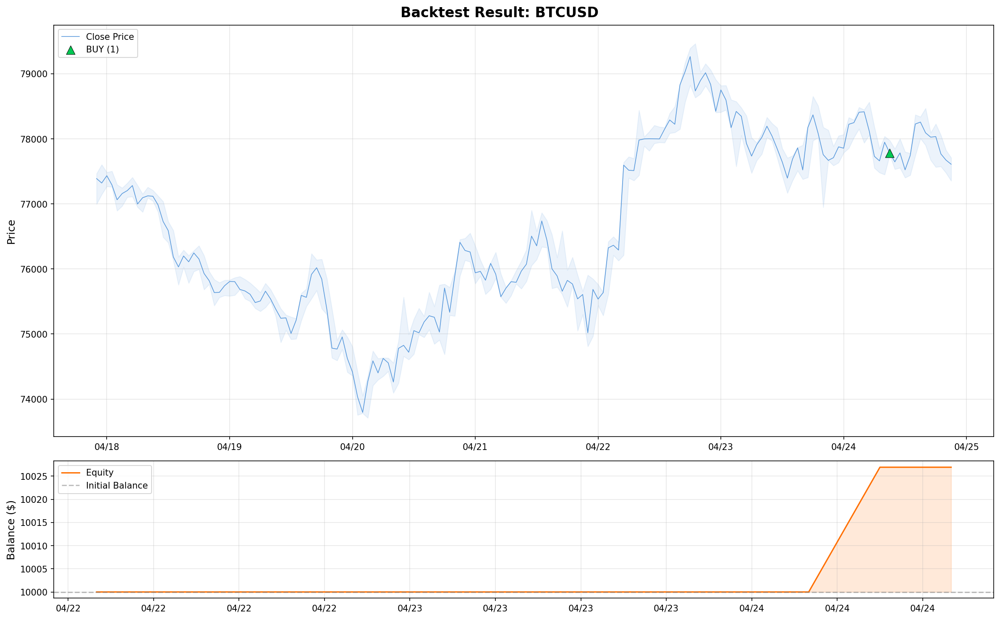

# 📊 Backtest Report: BTCUSD

**생성일시**: 2026-04-25 17:16:27  
**데이터 기간**: 2026-04-17 22:00 ~ 2026-04-24 21:00  
**총 캔들 수**: 168  

## 📈 성과 요약 (Performance Summary)

| 지표 | 값 |
|------|----|
| 초기 잔고 | $10,000.00 |
| 최종 잔고 | $10,026.92 |
| 순 손익 (Net PnL) | $+26.92 (+0.27%) |
| 총 매매 횟수 | 1 |
| 승리 / 패배 | 1 / 0 |
| 승률 (Win Rate) | 100.0% |
| 평균 손익 | $+26.92 |
| 최대 수익 (Best Trade) | $+26.92 |
| 최대 손실 (Worst Trade) | $+26.92 |
| 최대 낙폭 (MDD) | 0.0% |
| 수익 팩터 (Profit Factor) | inf |

## 📉 차트 (Price Chart + Equity Curve)

## 📋 매매 내역 (Trade Log)

| # | 시간 | 방향 | 진입가 | SL | TP | 랏 | 결과 | 손익 |
|---|------|------|--------|----|----|-----|------|------|
| 1 | 2026-04-24 09:00 | 🟢 BUY | 77782.97000 | 77350.00000 | 77900.00000 | 0.23 | ✅ TP_HIT | $+26.92 |

## 🤖 AI 추론 기록 (샘플)

### Trade #1 (2026-04-24 09:00)
> 전략가의 Bollinger Bands Double Bottom 가설은 시장이 77450 부근에서 첫 번째 저점을 형성하고 강한 반등 후 현재 두 번째 저점을 형성하려는 움직임을 보인다는 점에서 타당합니다. 특히 H1 캔들의 강한 반등은 매수세 유입을 시사합니다. 과거 유사 매매 일지에서 이와 상충되는 실패 기록이 없으므로, 해당 매매를 승인합니다. 손절가는 첫 번째 저점인 77450 아래인 77350으로 설정하여 더블 바텀 패턴이 무효화될 경우 즉시 손실을 제한합니다. 목표가는 반등의 폭을 고려하여 77900으로 설정합니다.

