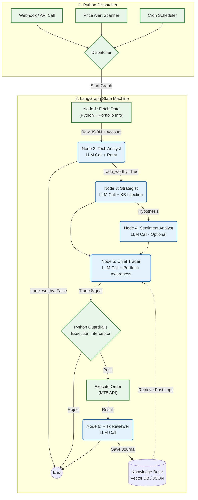

# Agent Workflow Design (LangGraph Pipeline)

이 문서는 Agentic Trader의 핵심 두뇌 역할을 하는 멀티 에이전트 아키텍처를 정의합니다. 자율형 CLI 에이전트의 불확실성을 배제하고, **FastAPI + LangGraph** 기반의 확정적(Deterministic) 파이썬 상태 머신(State Machine)으로 제어 흐름을 강제합니다.

## 0. 아키텍처 다이어그램 (LangGraph Nodes & Edges)

파이썬 오케스트레이터가 그래프의 각 노드(Node)를 순차적으로 실행하며, LLM API를 호출하여 상태(State)를 업데이트합니다.

## 1. 트리거링 시스템 (Python Dispatcher)
백그라운드에서 도는 파이썬 스크립트나 FastAPI 엔드포인트가 시장 이벤트를 감지하여 LangGraph 파이프라인(Workflow)을 격발시킵니다.
*   크론 스케줄러: 1시간봉, 4시간봉 완성 시점.
*   웹훅/API: 사용자의 수동 분석 요청.

## 2. 그래프 노드 정의 (LangGraph Nodes)

각 노드는 파이썬 함수이며, 내부에 프롬프트를 조립하여 LLM API(Gemini/Claude)를 호출하는 로직이 들어있습니다.

### Node 1: Fetch Data (Pure Python)
*   **동작:** MT5 API에서 캔들 데이터뿐만 아니라 **현재 계좌 잔고(Balance) 및 미결제 약정(Open Positions)** 정보를 함께 가져옵니다. 이를 통해 이후 노드들이 자금 관리 맥락을 파악할 수 있게 합니다.

### Node 2: Tech Analyst (LLM)
*   **동작:** 데이터를 분석하여 추세를 요약하며, 특히 **`trade_worthy` (매매 적합성)** 여부를 판단합니다. 시장이 횡보장일 경우 조건부 라우팅을 통해 파이프라인을 조기 종료(Short-circuit)합니다.

### Node 3: Strategist (LLM)
*   **동작:** `docs/trading-strategies/`에 저장된 공식 전략 지표 파일들을 컨텍스트로 주입받아, 시스템의 원칙에 맞는 매매 가설을 세웁니다.

### Node 4: Sentiment Analyst (LLM - Optional)
*   **동작:** 뉴스 API 등의 텍스트를 읽고 거시적 분위기를 요약합니다.

### Node 5: Chief Trader (LLM + RAG)
*   **동작:** 모든 분석 결과와 **현재 계좌 상태(Exposure)**를 종합하여 최종 결정을 내립니다. 

### Node 6: Risk Reviewer (LLM)
*   **동작:** 매매가 청산된 후, 당시 Node 5가 내렸던 판단과 실제 결과를 LLM에게 주어 '반성문(Trading Journal)'을 작성하게 하고 이를 DB에 저장합니다.

## 3. LangGraph의 압도적 장점
*   **Fault-Tolerant Retry:** LLM API 호출 실패 시 지수 백오프(Exponential Backoff) 기반의 재시도 로직이 적용되어 있습니다.
*   **Zero Hallucination Routing:** 조건부 엣지(Conditional Edges)를 사용하여 불필요한 노드 실행을 차단하고 비용을 절감합니다.
