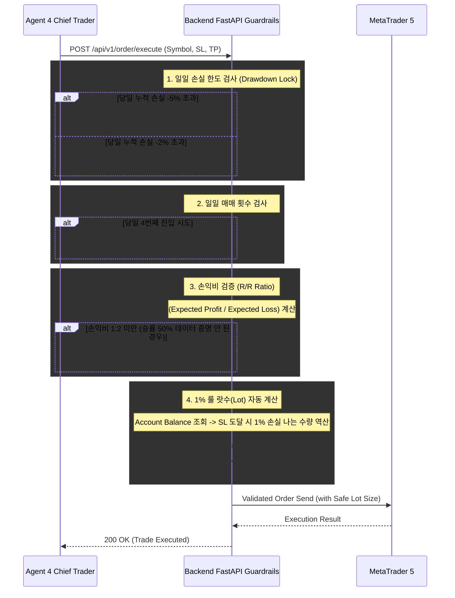

# Safety Guardrails (백엔드 절대 방어 규칙)

이 문서는 사용자의 "감정 없는 원칙 매매" 철학을 백엔드 서버(FastAPI)의 **하드코딩된 차단 로직(Interceptor)**으로 번역한 명세서입니다.

AI 에이전트(`Chief Trader`)가 아무리 완벽한 매매 시나리오를 작성하더라도, 백엔드에 전송된 주문 요청이 아래 5가지 절대 규칙 중 하나라도 위반한다면 해당 주문은 즉시 기각(Reject)됩니다.

## 0. 차단 로직 시각화 (Interceptor Diagram)

## 1. 1% 룰 기반의 '최대 랏수 강제 계산기'
*   **원칙:** 모든 거래는 1% 룰에 따라 적절 랏수를 계산하여 진입한다.
*   **시스템 구현:** AI는 주문 시 진입 방향(Long/Short)과 **손절가(SL)**만을 명시합니다. 백엔드는 실시간으로 MT5 총 자본(Equity)을 조회한 후, 해당 SL에 도달했을 때 잃게 되는 금액이 **정확히 자산의 1%**가 되도록 계약 수(Lot)를 강제로 재계산하여 주문을 실행합니다. AI가 요청한 임의의 비중(Lot)은 무시됩니다.

## 2. 일일 손실 한도 (Daily Drawdown Lock) ⚠️ 가장 중요
*   **원칙:** 그날 손실이 2% 이상이면 1시간 매매 중단, 5% 이상이면 당일 매매를 완전히 중단한다.
*   **시스템 구현:** 백엔드 내부에 Circuit Breaker 모듈을 가동합니다.
    *   **Level 1 (1시간 쿨다운):** 당일 누적 손실 -2% 도달 시, 백엔드는 향후 1시간 동안 AI의 모든 신규 진입 요청을 `403 Forbidden` 처리합니다. (기존 포지션 유지/청산은 가능)
    *   **Level 2 (일일 하드 락):** 당일 누적 손실 -5% 도달 시, 다음 날 00:00(서버 시간 기준)까지 모든 신규 진입 주문을 거부합니다.

## 3. 하루 최대 매매 횟수 제한 (Over-trading 방지)
*   **원칙:** 하루 매매 횟수는 3회 이하로 제한한다.
*   **시스템 구현:** 백엔드 DB(또는 인메모리 캐시)에 당일 진입(Open) 주문이 체결된 횟수를 카운트합니다. 당일 4번째 진입을 시도하는 API 호출은 즉시 기각됩니다. 이는 AI의 뇌동매매 및 과도한 빈도 거래(Over-trading)를 차단합니다.

## 4. 최소 손익비 검증 로직 (R/R Ratio Validator)
*   **원칙:** 계획된 손익비는 최소 1:2 이상이어야 한다. (승률 증명 시 1:1.2 가능)
*   **시스템 구현:** 주문 요청(Payload)에 포함된 `가격(Price)`, `손절선(SL)`, `익절선(TP)`의 간격을 백엔드가 계산합니다. `예상 수익폭 / 예상 손실폭` 의 값이 **2.0 미만**으로 산출될 경우 해당 주문은 불량한 진입 타점으로 간주되어 거부됩니다.

## 5. 손절/익절 라인(SL/TP) 수정 1회 제한
*   **원칙:** 손절 및 익절 라인 수정은 '관점 변경' 시에만 1회에 한해 허용한다.
*   **시스템 구현:** MT5에 체결된 포지션(Ticket ID)별로 Modify API(수정 요청) 호출 횟수를 기록합니다. 이미 1회 수정이 가해진 포지션에 대해 AI가 또다시 SL 라인을 뒤로 미루려 하거나 TP를 수정하려고 시도하면 해당 요청을 에러 처리합니다. (끝없는 '물타기' 및 '손절 연기' 원천 차단)
