# System Execution Flow

이 문서는 외부 트리거(Cron, Webhook)로부터 시작되어 LangGraph 에이전트 파이프라인을 거치고, 최종적으로 FastAPI 가드레일을 통과하여 MT5 터미널에 주문이 들어가는 **End-to-End 전체 시스템 실행 플로우**를 보여주는 다이어그램입니다.

## 실행 플로우 시퀀스 (Execution Flow Sequence)

```mermaid
sequenceDiagram
    participant User as Cron / Webhook
    participant FastAPI as FastAPI (Dispatcher)
    participant Graph as LangGraph Engine
    participant Agent as LLM Agents (Nodes)
    participant Core as Guardrails (backend/core)
    participant MT5 as MT5 Client (backend/services)

    User->>FastAPI: Trigger Trading Cycle (POST /api/v1/trade/trigger)
    activate FastAPI
    FastAPI->>Graph: Initialize Workflow (Graph Start)
    activate Graph

    %% Node 1
    Graph->>MT5: 1. Fetch OHLCV Data (Node 1)
    MT5-->>Graph: Raw Pandas DataFrame
    opt PERSIST_MARKET_CANDLES=1
        Graph->>DB: Upsert runtime candles by symbol/timeframe/time
    end
    Graph->>Graph: Calculate Indicators (EMA, ADX, ATR, Bollinger, RSI)
    
    %% Node 2, 3, 4
    Graph->>Agent: 2. Tech Analyst (Prompt + Data + Retry)
    Note over Graph, Agent: Conditional Edge: END if trade_worthy=False
    Agent-->>Graph: Tech Summary (JSON)
    
    Graph->>Agent: 3. Strategist (Summary + Strategies KB)
    Agent-->>Graph: Trading Hypothesis (JSON)
    
    %% Node 5
    Graph->>Agent: 4. Chief Trader (Hypothesis + Past Journals)
    Agent-->>Graph: Final Order Object ({"action": "BUY", "sl": 60000})
    
    Graph-->>FastAPI: Return Output State
    deactivate Graph

    %% Validation & Execution
    FastAPI->>Core: 5. Validate Order (Execution Interceptor)
    activate Core
    Core->>Core: Check Portfolio Exposure
    Core->>Core: Check Daily Loss Limit
    Core->>Core: Check Max Trades
    Core->>Core: Validate Risk/Reward Ratio (> 2.0)
    Core->>Core: Calculate Safe Lot Size (1% Rule)
    Core-->>FastAPI: Safe Order Payload
    deactivate Core

    %% MT5 Order
    FastAPI->>MT5: 6. Send Market Order (Lot size overridden)
    activate MT5
    MT5-->>FastAPI: Execution Result (Ticket, Price)
    deactivate MT5
    FastAPI->>FastAPI: 7. Persist tracked position (Local JSON + SQLite mirror)
    
    FastAPI-->>User: 200 OK (Trade Executed)
    deactivate FastAPI

    loop Polling or POST /api/v1/trade/reconcile
        FastAPI->>MT5: Check open positions / deal history
        MT5-->>FastAPI: Closed trade, if any
        FastAPI->>Graph: Run Risk Reviewer only after close
    end
```



---

## 백테스팅 실행 플로우 (Backtesting Flow)

백테스팅은 실제 운영 환경과 동일한 `LangGraph Engine`을 사용하되, 하단 인프라 레이어(MT5)를 모킹하여 실행됩니다.

```mermaid
sequenceDiagram
    participant Runner as Backtest Runner (Python)
    participant DB as SQLite Market Data
    participant Graph as LangGraph Engine
    participant Mocker as MT5 Adapter Mocker
    participant Report as Reporting Module

    Runner->>DB: Load Historical Candles by Symbol/TF/Date
    Runner->>DB: Insert backtest_runs status=running
    loop For each candle interval
        Runner->>Mocker: Inject Current Window Data
        Runner->>Graph: app.invoke(mocked_state)
        Graph->>Graph: Agentic Analysis (Flash Model)
        Graph-->>Runner: Return Decision (BUY/SELL/WAIT)
        Runner->>DB: Insert backtest_decisions immediately
        Runner->>Runner: Open one position or keep existing position
        Runner->>Runner: Check elapsed candles for SL/TP
        Runner->>DB: Insert backtest_trades immediately when closed
        Runner->>Graph: Run Risk Reviewer only when position closes
        Runner->>Runner: Record PnL & Equity
    end
    Runner->>DB: Update backtest_runs status=completed
    Runner->>Report: Generate Statistics & Chart
    Report-->>Runner: Save Markdown + PNG files
    Runner->>DB: Archive Markdown body only; report/chart paths are optional artifacts
```

## 플로우 핵심 요약
1. **Dispatcher:** 스케줄러나 웹훅이 FastAPI의 엔드포인트를 때리면 전체 루프가 시작됩니다.
2. **Fault-Tolerant Graph:** 각 LLM 노드는 API 실패 시 자동 재시도하며, 필터 라우팅을 통해 횡보장에서 조기 종료합니다.
3. **Execution Interceptor:** LangGraph 출력을 `backend/core/guardrails`에서 최종 검증한 뒤 `mt5_client`로 전달하는 실행 접착제 로직이 포함되어 있습니다.
4. **Lot Size Override:** AI가 아무리 큰 비중을 베팅하려 해도, 가드레일 모듈이 잔고의 1%만 잃도록 랏(Lot) 수를 강제 재계산(Override)하여 MT5로 전송합니다.
5. **Post-Close Review:** Risk Reviewer는 주문 직후가 아니라 포지션 청산이 확인된 뒤에만 매매 일지를 생성합니다.
6. **Replayable Data:** 차트와 복기는 파일 경로가 아니라 `candles`, `backtest_runs`, `backtest_trades`, `backtest_decisions`에서 재구성합니다.
