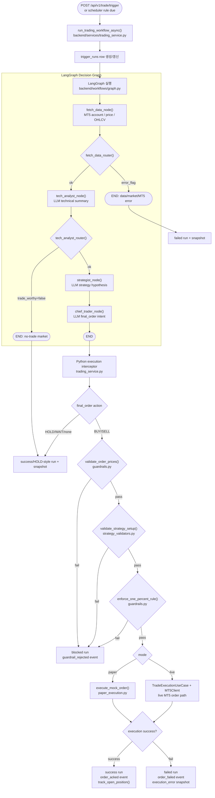
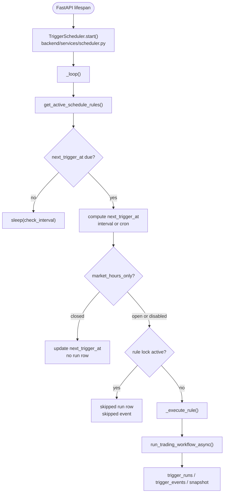
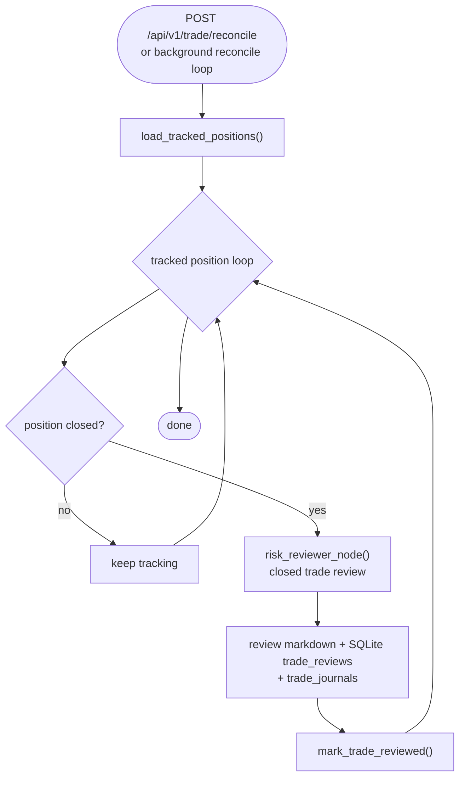

# LLM and Python Execution Flow

이 문서는 현재 코드 기준으로 트레이딩 판단, 주문 실행, 트리거 기록, 청산 후 복기가 어떻게 이어지는지 정리합니다.

핵심 원칙은 단순합니다. LangGraph는 판단 흐름을 만들고, Python service layer가 주문 가능 여부와 실행을 최종 통제합니다. LLM은 주문을 제안할 수 있지만, MT5나 paper execution을 직접 호출하지 않습니다.

## Decision Flow

## What LangGraph Does

`backend/workflows/graph.py`는 네 개 노드만 연결합니다.

- `fetch_data_node`
- `tech_analyst_node`
- `strategist_node`
- `chief_trader_node`

그래프 안에는 현재 주문 실행 노드가 연결되어 있지 않습니다. `backend/workflows/nodes.py`에 `execute_order_node()`는 남아 있지만, 현재 컴파일된 그래프에는 포함되지 않습니다.

## What Python Controls

주문 직전 통제는 `backend/services/trading_service.py`가 담당합니다.

- LangGraph final state를 읽습니다.
- `HOLD` / `WAIT`이면 실행하지 않고 종료합니다.
- `BUY` / `SELL`이면 Python guardrail을 순서대로 실행합니다.
- paper mode는 `execute_mock_order()`를 호출합니다.
- live mode는 `TradeExecutionUseCase(MT5Client())` 경로로 실제 MT5 주문을 보낼 수 있습니다.
- 모든 결과를 trigger run, event, snapshot에 기록합니다.

이 구조 때문에 LLM이 직접 주문을 실행하지 않습니다.

## Trigger Scheduler Flow

Scheduler는 언제 실행할지만 정합니다. 전략 판단, indicator 계산, guardrail 판단, 주문 실행은 scheduler에 넣지 않습니다.

## Market Hours Policy

`backend/features/trading/market_hours.py`가 market-hours 정책을 담당합니다.

- Forex symbols는 일요일 22:00 UTC부터 금요일 22:00 UTC까지 열려 있는 것으로 봅니다.
- `BTCUSD`, `ETHUSD`는 crypto로 보고 24/7 open 처리합니다.
- scheduler와 workflow 모두 symbol을 넘겨 같은 정책을 사용합니다.

## Trigger Observability

트리거 실행 결과는 `trading_logs/trigger_history.sqlite`에 남습니다.

- `trigger_schedule_rules`: 실행 규칙
- `trigger_runs`: 실행 1회의 요약
- `trigger_events`: 실행 중 발생한 timeline event
- `trigger_execution_snapshots`: request, final_state, final_order, guardrail_result 등 진단 payload
- `trade_journals`: trigger_id, trade_id, open/close/review payload를 이어 붙인 운영 복기 라이프사이클

운영자는 `GET /api/v1/triggers/{trigger_id}/journal`로 trigger snapshot과 trade journal을 한 번에 확인할 수 있습니다.

`events`는 순서 로그이고, `snapshot`은 실행 당시 상태 덤프입니다.

## Reconciliation and Risk Review

복기는 주문 직후가 아니라 포지션이 실제로 청산된 뒤에 실행됩니다. paper position은 로컬 추적 상태로, live position은 MT5 이력 조회로 청산 여부를 확인합니다.

Risk Reviewer는 `pnl`만 보지 않고 `process_quality`, `outcome_quality`, `rule_adherence`, `trade_quality_label`을 함께 기록합니다.

- `good_trade`: 과정과 결과가 모두 좋은 경우
- `mixed_trade`: 과정과 결과가 엇갈리는 경우
- `bad_trade`: 수익이 나더라도 전략/리스크 룰을 위반한 경우

따라서 익절한 거래라도 룰을 어겼다면 복기 기준상 좋은 매매가 아닐 수 있고, 손실이 났더라도 룰을 지킨 경우에는 과정 품질을 별도로 평가합니다. 이 분리는 `trade_reviews`와 `trade_journals`의 `review_log_json`에 함께 저장되어 후속 RAG/분석에 재사용됩니다.

## Key Files

- `backend/api/v1/trade.py`: 수동 trigger API
- `backend/api/v1/triggers.py`: trigger rule/history/detail/events/snapshot API
- `backend/api/app.py`: FastAPI lifespan, scheduler start/stop
- `backend/services/scheduler.py`: interval/cron background scheduler
- `backend/services/trading_service.py`: graph 실행 후 guardrail/execution/logging 통제
- `backend/workflows/graph.py`: LangGraph decision graph
- `backend/workflows/nodes.py`: LLM nodes and data fetch node
- `backend/features/trading/guardrails.py`: price/risk guardrails
- `backend/features/trading/strategy_validators.py`: deterministic strategy gates
- `backend/features/trading/adapters/paper_execution.py`: paper order execution
- `backend/features/trading/adapters/mt5_execution.py`: MT5 live order adapter
- `backend/features/trading/persistence/trigger_store.py`: trigger DB store
- `backend/features/trading/persistence/trading_log_store.py`: trade journal / review store
- `backend/features/trading/operations/position_tracker.py`: position tracking and reconciliation
