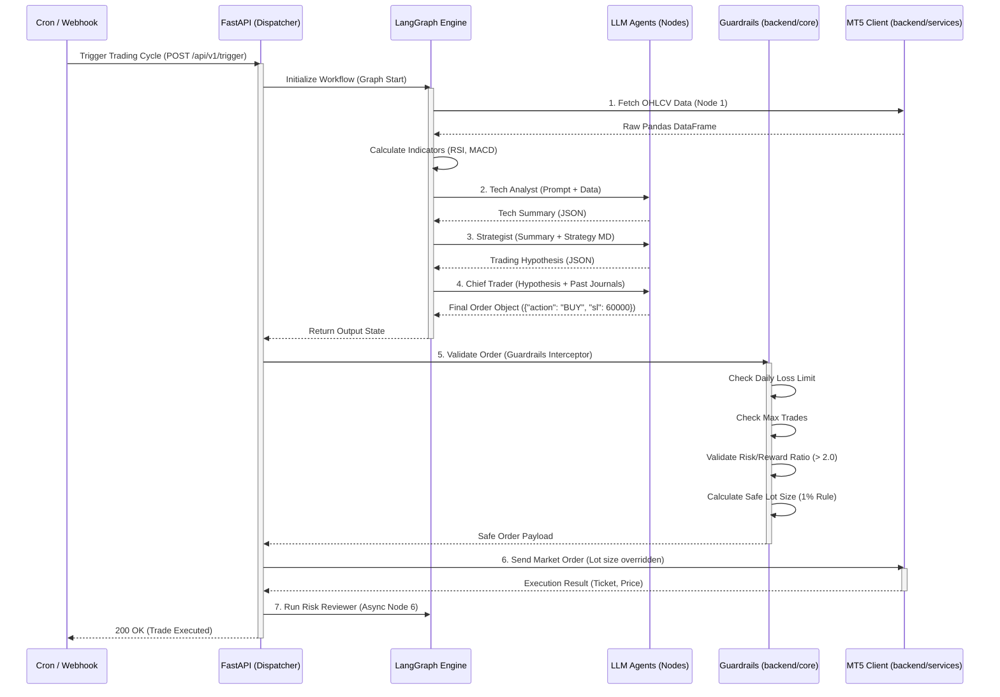

# System Execution Flow

이 문서는 외부 트리거(Cron, Webhook)로부터 시작되어 LangGraph 에이전트 파이프라인을 거치고, 최종적으로 FastAPI 가드레일을 통과하여 MT5 터미널에 주문이 들어가는 **End-to-End 전체 시스템 실행 플로우**를 보여주는 다이어그램입니다.

## 실행 플로우 시퀀스 (Execution Flow Sequence)

## 플로우 핵심 요약
1. **Dispatcher:** 스케줄러나 웹훅이 FastAPI의 엔드포인트를 때리면 전체 루프가 시작됩니다.
2. **Deterministic Graph:** LangGraph는 LLM이 자유롭게 행동하게 두지 않고, 정해진 순서대로(데이터 수집 -> 분석 -> 전략 -> 결정)만 API를 호출합니다.
3. **Hard-coded Interceptor:** AI(Chief Trader)가 매매 결정을 내리더라도, 최종적으로 FastAPI 단의 `Guardrails` 모듈을 통과하지 못하면 MT5 클라이언트로 주문이 넘어가지 않고 거부됩니다.
4. **Lot Size Override:** AI가 아무리 큰 비중을 베팅하려 해도, 가드레일 모듈이 잔고의 1%만 잃도록 랏(Lot) 수를 강제 재계산(Override)하여 MT5로 전송합니다.